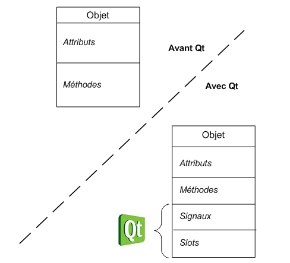
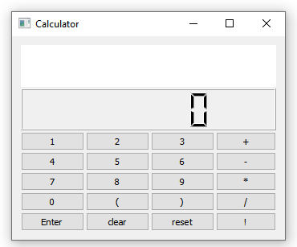
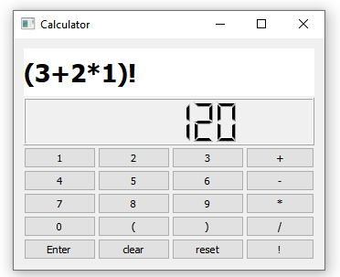
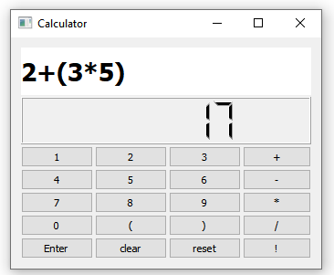
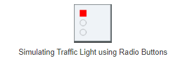
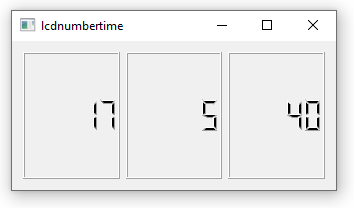

# **Signals and Slots**

**hello and Welcome Back ...**

In the previous chapter ,we start mastering the creation of Gui Applications , we had a solid foundation of Layouts and Widgets and we made some greats examples !

---

Now We are going to discover the mechanism of **signals and slots**, a principle specific to Qt which is clearly one of its strong points. This is an attractive technique for handling events within a window.
For example, if we click on a button, we would like a function to be called to react to the click. This is precisely what we will learn to do in this chapter, which will finally make our application dynamic!

## But what exactly are they?

**_A signal:_** it is a message sent by a widget when an event occurs.

    Example: we clicked on a button.

**_A slot:_** this is the function that is called when an event has occurred. We say that the signal calls the slot. Concretely, a slot is a method of a class.

    Example: the quit () slot of the QApplication class causes
     the program to stop.

NB: Qt considered **Signals and slots** as a part of a class, in addition to attributes and methods.

Here is a diagram that shows what an object could contain before Qt, as well as what it can contain now that we are using Qt:



 Let's create our first Gui Interactive Widget.

# Calculator

This exercise follows up to add **interactive** functionality to the **calculator** widgets written in the previous homework. How could we forget!

Our goal is to use **Signals and Slots** to simulate a basic calculator behavior then adding more functionnalities if we could

hence we have already worked on this example ,we will move to the good part ; **reactivity**



To help our calculator handeling digits and operations and having a computing functionality, we will represent any mathematical operation by:

          left   (op)  right

where `(op)` is one of the following allowed operation `+ - * /`.

Hence we will add the following private members to our class `calculator.h`.

```c++
private:
    int * left;          //left operand
    int * right;         // right operand
    QString *operation;  // Pointer on the current operation
```

- ## **Digits Interaction**
  Our first step is to respond to each **digit** click.  
   The trivial solution is to create a **slot** for each button, but that will be cumbersome. taht's why we will use the **Sender** approach which allow a slot to get the **identity** of the sender object. From that we could get which
  button was clicked. Hence we will define only one slot such as:

    ```c++
    public slots:
      void newDigit();
    ```

  Hence we will add the connect the connect all the digits buttons to this slot .

  ```c++
  //Connecting the digits
  for(int i=0; i <10; i++)
      connect(digits[i], &QPushButton::clicked,
              this, &Calculator::newDigit);
  ```

  Then let's implement the `newDigit` slot to show the digit in the `LCDNumber`.

  ```c++
  //Getting the identity of the button using dynamic_cast
  auto button  = dynamic_cast<QPushButton*>(sender());

  // Each button has his own digit in the text
  auto value = button->text()->toInt();

  //Displaying the digit
  disp->display(value);
  ```

  Now each time, you will click on a button, his digit will be **shown** in the LCDNumber.
  But we should clarify two points to clearly understand the implementation:

  1.  Which number, should be constructing `left` or `right`
  2.  How to add digit to an existing number.

  Here is the full implementation of this function using the _mentioned_ details:

  ```c++
  void  Calculator::newDigit(){

  //Getting the identity of the button using dynamic_cast
    auto button  = dynamic_cast<QPushButton*>(sender());

    // Each button has his own digit in the text
    auto value = button->text().toInt();

    if(!operation){

        if(!left)
        left = new int{value};
        else
        *left=*left*10+value;

     disp->display(*left);

     //to siplay all the expression in QLabel
     form=form+QString::number(value);
     label->setText(form);

    }else {
           if(!right)
                right = new int{value};
           else
                *right = 10 * (*right) + value;

              disp->display(*right);

              form=form+QString::number(value);
              label->setText(form);

              //this process will help us making multiple operations
                if(*operation == "+"){
                    *left=*right+*left;
                }else if(*operation == "-"){
                   *left=*left-*right;
                }else if(*operation == "*"){
                     *left=*left*(*right);
                }else if(*operation == "/"){
                    if(*right==0){
                         disp->display("error");}
                     else{*left=*left/(*right);}
                }
    }

  }
  ```

  through this method we can display numbers by clicking on the digits.

  **but not only !**

  we have also included a QLabel that print the full expression (numbers and operations) that we want to calculate .

  and finally the result of operation betwen rigth and left is assigned to left in order to help us display a complex expression such as (24 \* 23 + 23)!

      NB: this way of working will extremely reduce the enterSlot !

  

- ## Operation Interaction
  Now we will move on the `operation` of the four buttons. We will the same mechanism using the `sender` method. Hence we will define a single slot to handle the click on the operations buttons:

  ```c++
    void  Calculator::changeOperation()
  {
    //Getting  the  sender  button
    auto  button  =  dynamic_cast<QPushButton*>(sender());
    //Storing  the  operation
    operation  =  new  QString{button->text()};
    //Initiating  the  right  button
    right  =  new  int{0};
    //reseting  the  display
    disp->display(0);
  }
  ```

- ## Enter Button
  The important touch ! Since we've calculated our expression/operation in newDigit(),we only need to display the pointer that refers to the result(*left).  
   we only have one line of code (dislaying) :

  ```c++
  void  Calculator::enterSlot()
      disp->display(*left)
  }
  ```

- ## Reset Button
  A simple button that reset our calculator to its initial state

  ```c++
  void  Calculator::resetSlot(){
    //reseting the *right an *left
    right  =  new  int{0};
    left  =  new  int{0};

    //reseting  the  display
    disp->display(0);
    //reseting  the QLabel
    form="";
    label->setText(form);
  }
  ```

  - ## Clear Button
    Differently to rest button **clear** only removes the last operation performed

  ```c++
  void  Calculator::clearSlot(){
      if(operation){
            if(*operation == "+"){
                *left=*left-*right;
            }else if(*operation == "-"){
               *left=*left+*right;
            }else if(*operation == "*"){
                if(*right==0){
                      disp->display("error");}
            else{ *left=*left/(*right);}
            
            }else if(*operation == "/"){
                 *left=*left*(*right);
            }
      }
      display(0);
    }
  ```

  - ## Parenthesis ( ) for a correct mathematical calculation

  We've succed to execute multiple opérations , but is the result always mathematicly correct ? **I don't think so !!**

  as we all know multiplication precede addition, unfortunatly this concept isn't availble while using right/left approach,that's why we thought about Parenthesis:

  - We've created the " ( " button , then we connected it to parenthesis1Slot() ;
    the same calculation process will be repeated between the parenthesis
    **But** , we should be careful when dealing with the operand before the () ,it should be stored ,as well as the operation before .
    that's why we 've initiate two pointer ; **_store_** to save the previous left value and **_storeoperation_** for the operation

  ```c++
  void  Calculator::parenthesis1Slot(){
  // keeping the part before ()
    store=new  int{*left};
    storeoperation=  new  QString{*operation};
  // starting a new process within ()
      left  =  nullptr;
    operation=nullptr;
    disp->display(0);
    // displaying ( in the QLabel
    form=form+"(";
    label->setText(form);
  }
  ```

  our work isn't finished yet , our calculator must close the parenthesis and follow its normal process:

  - so, We've created the " ) " button , then we connected it to parenthesis2Slot() ;

  here is how it operates:

  ```c++
  void  Calculator::parenthesis2Slot(){
    if(*storeoperation  ==  "+"){
        *left=*store+*left;
    }else  if(*storeoperation  ==  "-"){
      *left=*store-*left;
    }else  if(*storeoperation  ==  "*"){
      *left=*store*(*left);
    }else  if(*storeoperation  ==  "/"){
      if(*left==0){disp->display("error");}
         else {*left=*store/(*left);}
    }
  disp->display(0);

  form=form+")";
  label->setText(form);
  }
  ```

  ;

# **Traffic Light**


  Before starting ,let's learn about QTimer

 - **Timer Event**

  The QTimer class provides repetitive and single-shot timers.

  The QTimer class provides a high-level programming interface for timers. To use it, create a QTimer, connect its timeout() signal to the appropriate slots, and call start(). From then on, it will emit the timeout() signal at constant intervals.

  let's make things concrete

  

  After creating the form using Radio Buttons
  ,we declare our timer event

  > void timerEvent(QTimerEvent \*) override;

  then , start out timer so that as soon as the signal is emitted, our event timerEvent() runs every seconds (1000ms).
  ç

  ```c++
  TrafficLight::TrafficLight(QWidget * parent): QWidget(parent){
    //Creatign the widgets
    createWidgets();
    //place Widgets
    placeWidgets();
    //start the timer
      startTimer(1000);
  }
  ```

  to have a realistic traffic-light, the time of each light should be destributed as following :
  2 sec for green light ,1 sec for the yellow ,and 4 for the red light let's make a cyclic process (modulo 7)

  ```c++
  void TrafficLight::timerEvent(QTimerEvent *){
  index=(index+1)%7;
  if(index==5)
      yellowlight->toggle();
  else if(index==6||index==0)
      greenlight->toggle();
  else
      redlight->toggle();
  }
  ```
  We can also modified this automatic cycle through a key Event , and it's a good opportunity for us to introduce this aspect

  - **keyPressEvent**

  This slot will be trigger automatically each time we click on keyboard key. The information of the key will be store in the class QKeyEvent.

  ```c++
  void TrafficLight::keyPressEvent(QKeyEvent *e){
    if(e->key() == Qt::Key_R)
        redlight->toggle();
    else if(e->key() == Qt::Key_Y)
        yellowlight->toggle();
    else if(e->key() == Qt::Key_G)
        greenlight->toggle();

    l
  }
  ```

**what a great example** let's have another one

# **Digital clock using QLCnumber**



As we can see , our Widget contains 3 QLCnumbers where we have to update the time by displaying the curreent time each second

let's code :

```c++
void digitalmontre::timerEvent(QTimerEvent *e){
 updateTime();
}
```

and here is our updateTime method :

```c++
void digitalmontre::updateTime(){
    auto t= QTime::currentTime();
    hour->display(t.hour());
    minute->display(t.minute());
    seconde->display(t.second());

```

Our Clock works now smoothly

---

## Now that we know how to create our own signals and slots, we have all the flexibility to do whatever we want! see you in our next session .
